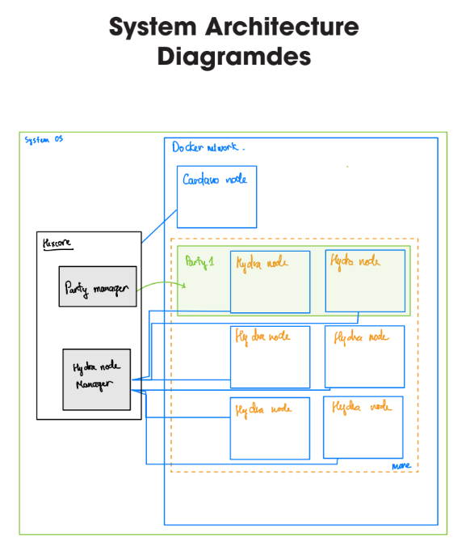
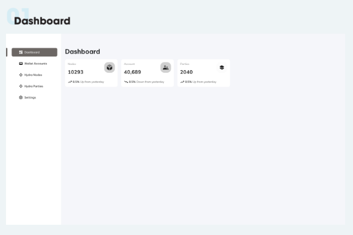
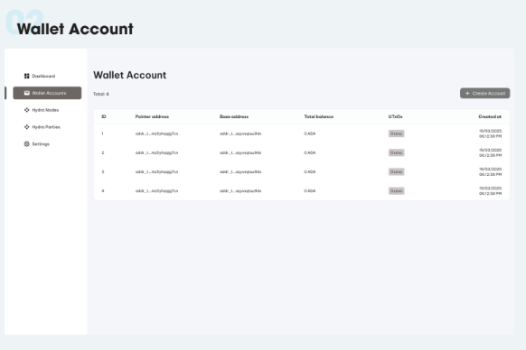
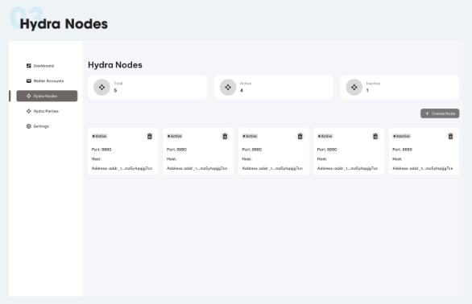
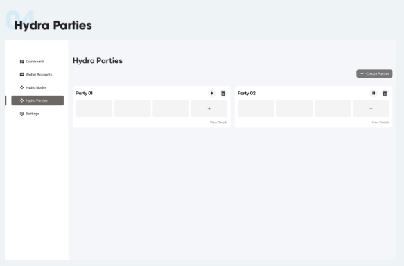

# HEXCORE - Project Details

## **1. Introduction**

**Hydra Hexcore** is a dedicated system for **managing and operating multiple Hydra Heads on a single server**, designed to simplify the setup, monitoring, and control of nodes within the Hydra network (a Layer 2 scaling solution for Cardano). This project serves as a central coordination hub, enabling the efficient, secure, and easy deployment of Hydra Heads.

## **2. Objectives**

- Create a **centralized platform** for managing multiple Hydra Heads flexibly on a single server.
- Provide an intuitive user interface and convenient command-line tools for interacting with the system.
- Ensure security, resource reusability, and easy scalability.

## **3. Key Features**

### 3.1. **Cardano Account Management**

- Create and manage `skey/vkey` key pairs for Cardano accounts.
- Accounts are used to bind to node containers during Hydra Head initialization.
- Verify account balances and validity before use.

### 3.2. **Hydra Head Initialization**

- Set up **a Hydra Party** based on the specified number of nodes (n-node party).
- Automatically select suitable accounts to launch nodes.
- Check the necessary technical conditions:
    - Cardano Node must be available (check via `node.socket`).
    - Required ports must not be in use.
    - Accounts must have sufficient balance to commit TXs (min ADA can be configured).
- Expected result after initialization:
    - A unique `Head ID`.
    - Corresponding endpoint URLs for each node container, for example:
        - `http://localhost:20010`
        - `http://localhost:20011`
        - ...

### 3.3. **Managing the Lifecycle of Hydra Heads**

- **Close Hydra Head**: Stop and remove the containers corresponding to the specific head.
- **Clear Persistence**: Delete temporary or stored data for each head.
- **Monitor operational status**:
    - Startup time.
    - Docker container status (running, exited).
    - Real-time logs of each container node.

## **4. System Architecture**

### 4.1. **Core Service**

- Written in **NestJS**, serves as the main backend of the system.
- Interacts with Docker using the `dockerode` library.
- Connects to the database:
    - **MySQL**: Stores user information, accounts, logs, etc.
    - **Redis**: Caches user session status, user sessions, etc.
- **Optional**: Some computational tasks and resource checks can be written in **Rust** and integrated into NestJS via native bindings (e.g., via NAPI) or WASM.

### 4.2. **Hexcore UI**

- Written using **Nuxt 3 (Vue 3)**.
- A visual interface for:
    - Manage Hydra Heads and nodes.
    - Manage Cardano accounts.
    - Login/logout, user permissions.
- User interface design mockups are available.

### 4.3. **Gateway Layer**

- Use **NGINX** as the primary reverse proxy:
    - Route to the corresponding Hydra node endpoints.
    - Protect access and limit public permissions when necessary.

### 4.4. **Extensions (Optional)**

- **hexcore-cli**:
    - Command-line tool for quickly initializing Hydra Head, checking status, etc.
    - Useful for admins or deploying automation scripts.
- **hexcore-proxy**:
    - A secure proxy layer to protect Hydra endpoints from unauthorized access.
    - Can integrate rate-limiting, API keys, or JWT.

## **5. Benefits & Impact**

- Reduce manual operations during Hydra network operations.
- Enables developers to easily create and test Hydra Heads in a centralized environment.
- Contributes to the adoption of Layer 2 applications on the Cardano ecosystem.

## **6. Development Roadmap**

| Phase | Description | Estimated Timeline |
| --- | --- | --- |
| Phase 1 | Complete Core backend, account management, and initialize Head | 10 weeks |
| Phase 2 | Develop UI, Head and account management interface | 4 weeks |
| Phase 3 | Gateway integration (nginx) and endpoint security | 2 weeks |
| Phase 4 | Develop CLI and Proxy | 5 weeks |
| Phase 5 | Comprehensive testing and resource optimization | 3 weeks |
| **Total** | — | **22 weeks** |

## **7. Conclusion**

**Hydra Hexcore** is a flexible and powerful platform for efficiently operating multiple Hydra Heads, simplifying the development, testing, and deployment of scalable Hydra Layer 2 solutions on Cardano. Combining NodeJS (NestJS), Vue (Nuxt 3), Docker, and scalability, the project promises to deliver a valuable tool for developers and researchers within the blockchain ecosystem and Cardano community.